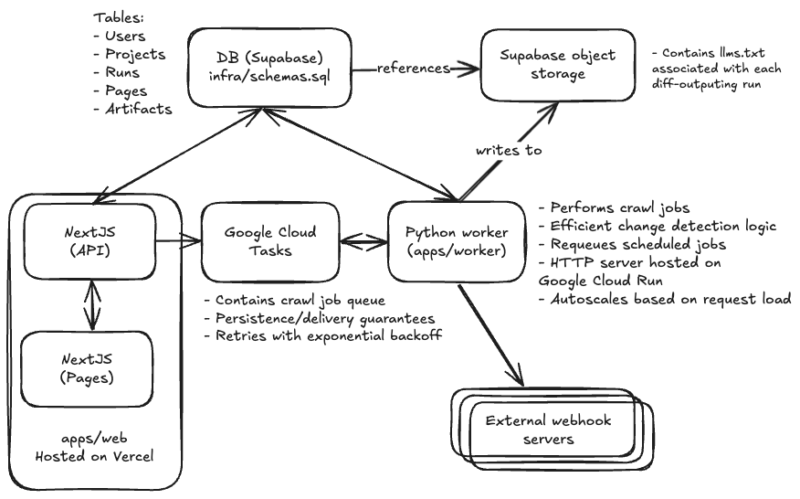

# LLMs.txt Crawler

A comprehensive web application and worker system that automatically generates and maintains `llms.txt` files for websites based on the standard described at llmstxt.org. The system monitors website changes and outputs a structured text artifact optimized for LLM consumption.

## Quickstart

Visit the live demo at https://llms-txt-generator.vercel.app/

- Sign in with Google to be redirected to the projects page.
- Create projects associated with a website and schedule llms.txt generations with a daily or weekly frequency.
- Creating a project will immediately trigger a run to generate an llms.txt for the site.
- Due to Google Cloud Run cold starts, it may take a while for the worker to ingest the job and update the run state to in-progress. You can press "refresh" to check for newly in-progress or complete jobs. The page will continuously refresh while an in-progress run is detected until the job is complete. (This could be fixed by setting minimum Cloud Run instances to 1, but for demo purposes I'm setting it to zero).
- When the worker detects new pages or page metadata changes compared to previous crawls, a new version of the llms.txt will be generated. Runs will automatically be executed with the frequency specified in the project configuration, but they can also be manually triggered on the project detail page.
- Add outgoing webhooks to receive a link to the updated llms.txt every time a run (manual or automated) generates a new version. Individual webhooks can be disabled or deleted.

## Overview

The LLMs.txt Crawler consists of two main components:

- **Web Application** (`apps/web`): A Next.js-based dashboard for managing projects, viewing generated llms.txt, and configuring automated monitoring
- **Worker Service** (`apps/worker`): A Python-based background service that crawls websites, detects changes, and generates `llms.txt` files

## Architecture



## Web Application (`apps/web`)

### Features

- **Google Authentication**: Secure sign-in using Google One Tap
- **Project Management**: Create, configure, and manage website monitoring projects
- **Dashboard**: View all your projects with status, last run times, and quick actions
- **Real-time Monitoring**: Track crawling progress and view detailed run histories
- **File Management**: Download generated `llms.txt` files and view change history
- **Webhook Configuration**: Set up webhooks to automatically update your site when changes are detected

## Worker Service (`apps/worker`)

### Core Functionality

The worker is a Python-based HTTP server deployed on Google Cloud Run that handles the heavy lifting of website crawling and `llms.txt` generation. It receives job requests via Google Cloud Tasks and processes them asynchronously.

#### Key Features

- **Intelligent Web Crawling**: Respects `robots.txt` and implements rate limiting
- **Change Detection**: Two-phase detection using HTTP headers and content hashing
- **Content Processing**: Extracts and normalizes web content for LLM consumption
- **LLMS.txt Generation**: Creates structured files following the llms.txt specification
- **Automated Scheduling**: Receives and enqueues scheduled crawl jobs via Google Cloud Tasks queue
- **Webhook Integration**: Notifies external systems when content changes

#### Change Detection Strategy

1. **Header-based Detection**: Uses ETag and Last-Modified headers for quick change identification
2. **Content-based Detection**: Falls back to SHA256 hashing of normalized content
3. **Smart Crawling**: Only processes pages that have actually changed

#### Content Normalization

- Removes timestamps and dynamic content that shouldn't affect change detection
- Strips script tags, style elements, and other non-content elements
- Normalizes whitespace and extracts meaningful text content

### Worker Modules

- **`crawler.py`**: Web crawling with change detection integration
- **`change_detection.py`**: Content change detection using headers and SHA256 hashing
- **`llms_generator.py`**: Generate LLMS.txt formatted content from crawl results
- **`storage.py`**: Database operations and run status management
- **`s3_storage.py`**: S3 upload operations and artifact management
- **`scheduling.py`**: Cron scheduling and task management
- **`webhooks.py`**: Webhook management and execution
- **`cloud_tasks_client.py`**: Google Cloud Tasks integration

## Setup Instructions

### Prerequisites

- Node.js 22.x
- Python 3.11+ with `uv` for package management
- Github account
- Vercel account (for Next deployment) with this repo linked and the output dir set to apps/web/.next
- Supabase account (for DB+Object Storage)
- Google Cloud account (for Cloud Tasks/Cloud Run) with a project that has an Artifact Registry repo and a Cloud Tasks queue, and a service account with access to deploy to the repo and write to the queue 

### Environment Variables

Create a `.env` file in the project root with the following variables.
In addition, they must all be configured as repo secrets on Github.

```bash
# Supabase Configuration
NEXT_PUBLIC_GOOGLE_CLIENT_ID=your_google_client_id_for_oauth
NEXT_PUBLIC_SUPABASE_URL=your_supabase_url
NEXT_PUBLIC_SUPABASE_ANON_KEY=your_supabase_anon_key
SUPABASE_SERVICE_ROLE_KEY=your_supabase_service_role_key
SUPABASE_PROJECT_ID=your_supabase_project_id

# Supabase object storage configuration
AWS_ACCESS_KEY_ID=your_aws_access_key
AWS_SECRET_ACCESS_KEY=your_aws_secret_key
S3_BUCKET_NAME=your_s3_bucket_name

# Google Cloud Tasks / Cloud Run
GOOGLE_CLOUD_PROJECT_ID=your_gcp_project_id
GCP_SA_KEY=your_gcp_service_account_key # GCP service account key
PROJECT_ID=your_gcp_project_id
REGION=your_gcp_region            # e.g. us-central1
REPOSITORY=your_gcp_container_repo # e.g. worker-repo
SERVICE=your_cloud_run_service_name    # e.g. llms-worker
WORKER_URL=https://your-worker-endpoint
PORT=8080

# Crawling Configuration (optional)
CRAWL_MAX_PAGES=100
CRAWL_MAX_DEPTH=2
CRAWL_DELAY=0.5
```

### Database Setup

1. Create a new Supabase project
2. Run the database schema from `infra/schemas.sql`:

```bash
# Connect to your Supabase database and run:
psql -h your-db-host -U postgres -d postgres -f infra/schemas.sql
```

### Web Application Setup

1. Install dependencies:

```bash
npm install
```

2. Start the development server:

```bash
npm run dev
```

The web application will be available at `http://localhost:3001`

### Worker Setup

1. Navigate to the worker directory:

```bash
cd apps/worker
```

2. Install Python dependencies using uv:

```bash
uv sync
```

3. Run the worker:

```bash
npm run dev
# or directly with Python:
uv run worker.py
```

The worker will start an HTTP server on port 8080 (configurable via `PORT` environment variable). It can be tested with test_worker.py, which creates a valid project/run in the Supabase DB before 

## Dependencies

### Web Application Dependencies

**Core Framework:**
- Next.js 15.4.2
- React 19.1.0
- TypeScript 5.9.2

**Authentication & Database:**
- @supabase/supabase-js 2.57.4
- @supabase/ssr 0.7.0
- google-one-tap 1.0.6

**Cloud Services:**
- @google-cloud/tasks 4.0.1

**UI & Styling:**
- Tailwind CSS 4.1.5

### Worker Dependencies

**Core Libraries:**
- python-dotenv 1.0.0+
- requests 2.31.0+
- beautifulsoup4 4.12.2+
- lxml 4.9.3+

**Cloud Services:**
- boto3 (AWS SDK)
- supabase 2.0.0+
- google-cloud-tasks 2.16.0+

## Usage

### Creating a Project

1. Sign in to the web application using Google
2. Click "Create New Project"
3. Enter your website URL and configuration:
   - **Name**: Friendly name for your project
   - **Domain**: Website URL to monitor
   - **Description**: Optional description
   - **Crawl Depth**: How many levels deep to crawl (default: 2)
   - **Schedule**: How often to check for changes (daily, weekly, etc.)

### Monitoring Changes

The system automatically:
1. Crawls your website at scheduled intervals
2. Detects content changes using intelligent algorithms
3. Generates updated `llms.txt` files when changes are found
4. Stores artifacts in S3 for download
5. Calls configured webhooks to notify external systems

### Downloading Generated Files

- Access your project dashboard
- View the latest run status
- Click "Download llms.txt" to get the generated file
- View change history to see what was updated

### Webhook Integration

Configure webhooks to automatically publish generated files to your website:

1. Go to project settings
2. Add webhook URL
3. Configure an optional secret
4. The system will POST a link to the generated `llms.txt` to your webhook

## API Reference

### Worker API

#### Process Job
```http
POST /
Content-Type: application/json

{
  "id": "job_123",
  "url": "https://example.com",
  "projectId": "project_456",
  "runId": "run_789",
  "isScheduled": false
}
```

#### Health Check
```http
GET /health
```

## Monitoring and Logging

The system provides comprehensive logging for:

- **Web Application**: User actions, API calls, authentication events
- **Worker**: Crawling progress, change detection results, S3 uploads, webhook calls
- **Database**: All operations are logged with timestamps and user context